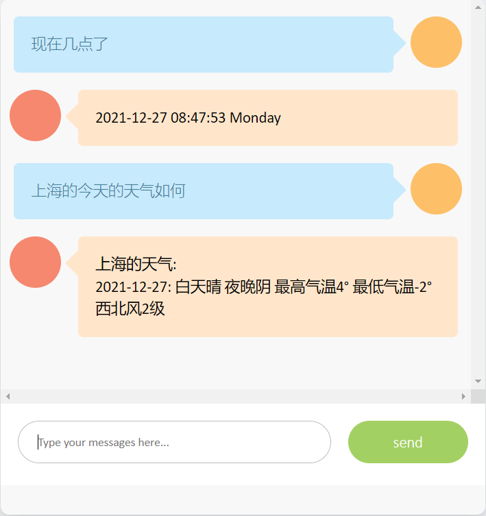

# RUN
you can run directed:
```shell
pip install --no-cache-dir -r requirements.txt
python app.py
```
or simple way by docker
```shell
docker build -t rasa_html .
docker run -d -p 5000:5000 rasa_html
```

# Dependence
```shell
flask==2.0.2
itsdangerous==2.0.1
Jinja2==3.0.3
MarkupSafe==2.0.1
```

# REST
REST channel: POST
http://<host>:<port>/webhooks/rest/webhook,
format:
{
  "sender": "test_user",  // sender ID of the user sending the message
  "message": "Hi there!"
}

The response from Rasa Open Source will be a JSON body of bot responses,
for example:
[
  {"text": "Hey Rasa!"}, {"image": "http://example.com/image.jpg"}
]


# Visit
local host to visit: 127.0.0.1:5000

# Display
